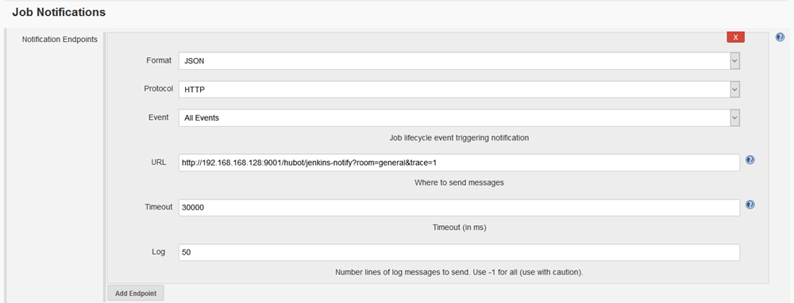

# hubot-jenkins-notifier

Notifies about Jenkins build errors via [Jenkins Notification Plugin](https://wiki.jenkins-ci.org/display/JENKINS/Notification+Plugin)

## Getting Started
1. Install the module: `npm install --save hubot-jenkins-notifier`
2. Add it `hubot-jenkins-notifier` to your external-scripts.json file in your hubot directory
3. Add hubot's endpoint to jenkins jobs `http://<hubot-host>:<hubot-port>/hubot/jenkins-notify?room=<room>` (see Screenshot)

### Screenshot

## Configuration
_(Coming soon)_

## Release History

0.1.5 - 2014-09-18

* Tweak configs to work with newer versions of npm / fix for travis-ci
* Support jenkins 1.577 (Now passes FINALIZED instead of FINISHED) - [Jenkins Notifier Commit](https://github.com/jenkinsci/notification-plugin/commit/2af09e3002ff887a5eaa7577b190f1cbb9c123e3)

0.1.4 - 2014-02-23

* Brought in recent changes from [github/hubot-scripts](http://www.github.com/github/hubot-scripts)
* Upgraded json parsing to handle/fail gracefully
* Handle jenkins not providing full url (for now not handled well, but better than undefined)
* Added screenshots to configuration

0.1.3 - 2013-08-05

* support hubot-irc adapter

0.1.2 - 2013-07-23

* allow `always_notify=1` cgi parameter to always notify a room even on success

0.1.1 - 2013-07-22

* Fixed up .npmignore file so the proper files were being packaged up

0.1.0 - Initial Release - 2013-07-20

* Based heavily on the [github/hubot-scripts](http://www.github.com/github/hubot-scripts) version which broke in our infrastructure

## License
Copyright (c) 2013 Gavin Mogan
Licensed under the MIT license.

